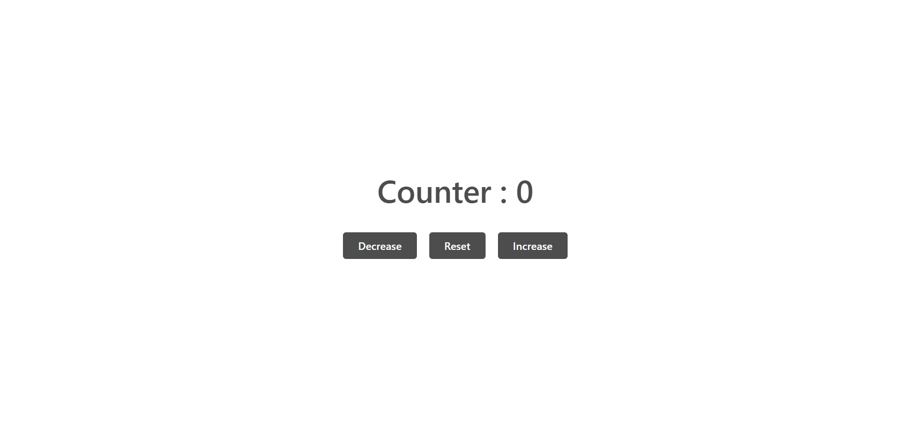

# Counter App

## Description

A JavaScript DOM project where users can play with the counter value. This app has three buttons that can be used to increase, decrease and reset the counter value. This project is created using HTML, CSS and Javascript.

### Preview of the project

### [Live link](https://counter-app-nu-mocha.vercel.app/) of the project.
